# Chief Technology Architect Analysis: SafeTrekr Marketing Site

**Date**: 2026-03-24
**Author**: Chief Technology Architect (Deep Analysis)
**Project**: SafeTrekr Marketing Website v3
**Stack**: Next.js 15 (App Router) / React 19 / Tailwind CSS 4 / Framer Motion / MapLibre GL JS / Vercel / Supabase / SendGrid / Plausible
**Mode**: Greenfield -- Pre-Implementation Architecture Specification
**Discovery Inputs**: 8 agent discoveries (CTA, React, UX, UI, IA, Narrative, Strategy, Digital Marketing)

---

## Table of Contents

1. [System Architecture](#1-system-architecture)
2. [Infrastructure Architecture](#2-infrastructure-architecture)
3. [Data Architecture](#3-data-architecture)
4. [API Design](#4-api-design)
5. [Security Architecture](#5-security-architecture)
6. [Performance Architecture](#6-performance-architecture)
7. [Observability Architecture](#7-observability-architecture)
8. [Integration Architecture](#8-integration-architecture)
9. [Deployment Pipeline](#9-deployment-pipeline)
10. [Compliance Architecture](#10-compliance-architecture)
11. [Enhancement Proposals](#11-enhancement-proposals)
12. [Risk Assessment](#12-risk-assessment)
13. [Priority Recommendations](#13-priority-recommendations)

---

## 1. System Architecture

### 1.1 High-Level System Context

The SafeTrekr marketing site is a statically-generated Next.js 15 application deployed on Vercel's Edge Network. It operates as a fully independent system from the SafeTrekr product application, sharing only a root domain (`.safetrekr.com`) for future cookie-based SSO readiness.

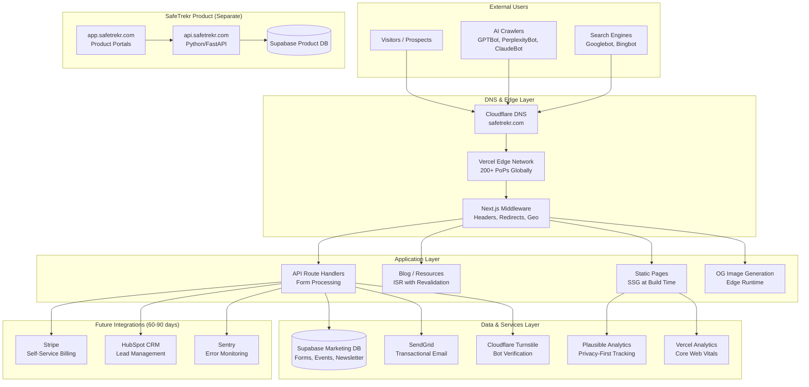

### 1.2 Application Architecture (Container Level)

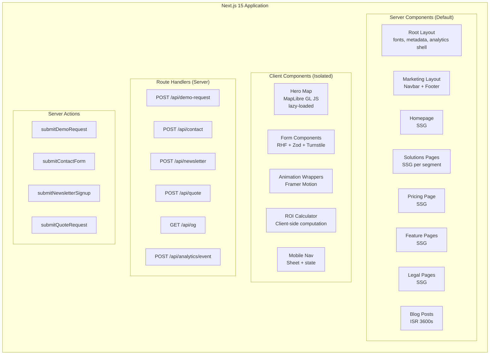

### 1.3 Component Architecture (4-Layer Model)

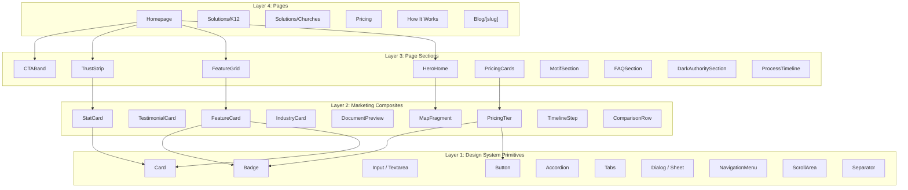

### 1.4 Directory Structure (Detailed)

```
safetrekr-marketing/
├── src/
│   ├── app/
│   │   ├── layout.tsx                    # Root: fonts (next/font), Plausible script, metadata defaults
│   │   ├── page.tsx                      # Homepage (SSG)
│   │   ├── not-found.tsx                 # Custom 404
│   │   ├── error.tsx                     # Global error boundary
│   │   ├── global-error.tsx              # Root error boundary
│   │   ├── sitemap.ts                    # Dynamic XML sitemap
│   │   ├── robots.ts                     # Dynamic robots.txt (allows AI crawlers)
│   │   ├── manifest.ts                   # Web app manifest
│   │   │
│   │   ├── (marketing)/                  # Route group: standard marketing pages
│   │   │   ├── layout.tsx                # Navbar + Footer wrapper
│   │   │   ├── how-it-works/page.tsx
│   │   │   ├── pricing/page.tsx
│   │   │   ├── about/page.tsx
│   │   │   ├── contact/page.tsx
│   │   │   ├── demo/page.tsx
│   │   │   ├── security/page.tsx
│   │   │   ├── procurement/page.tsx
│   │   │   │
│   │   │   ├── platform/
│   │   │   │   ├── page.tsx              # Platform overview
│   │   │   │   ├── analyst-review/page.tsx
│   │   │   │   ├── risk-intelligence/page.tsx
│   │   │   │   ├── safety-binder/page.tsx
│   │   │   │   ├── mobile-app/page.tsx
│   │   │   │   ├── monitoring/page.tsx
│   │   │   │   └── compliance/page.tsx
│   │   │   │
│   │   │   ├── solutions/
│   │   │   │   ├── page.tsx              # Solutions overview with segment selector
│   │   │   │   ├── k12/page.tsx
│   │   │   │   ├── churches/page.tsx
│   │   │   │   ├── higher-education/page.tsx
│   │   │   │   └── corporate/page.tsx
│   │   │   │
│   │   │   └── features/                 # Redirect to /platform (IA decision)
│   │   │
│   │   ├── (blog)/                       # Route group: blog layout with sidebar
│   │   │   ├── layout.tsx                # Blog-specific layout (narrower, sidebar)
│   │   │   ├── blog/
│   │   │   │   ├── page.tsx              # Blog index (ISR 3600s)
│   │   │   │   ├── [slug]/page.tsx       # Blog post (ISR 86400s)
│   │   │   │   └── category/
│   │   │   │       └── [category]/page.tsx
│   │   │   └── resources/
│   │   │       ├── page.tsx              # Resources hub
│   │   │       ├── sample-binders/page.tsx
│   │   │       ├── roi-calculator/page.tsx
│   │   │       ├── faq/page.tsx
│   │   │       ├── guides/[slug]/page.tsx
│   │   │       └── case-studies/[slug]/page.tsx
│   │   │
│   │   ├── (legal)/                      # Route group: legal pages
│   │   │   ├── layout.tsx                # Legal layout (narrow, no sidebar)
│   │   │   └── legal/
│   │   │       ├── terms/page.tsx
│   │   │       ├── privacy/page.tsx
│   │   │       ├── dpa/page.tsx
│   │   │       ├── acceptable-use/page.tsx
│   │   │       └── cookies/page.tsx
│   │   │
│   │   ├── (landing)/                    # Route group: paid acquisition landing pages
│   │   │   ├── layout.tsx                # Minimal layout (no nav, single CTA)
│   │   │   └── lp/[campaign]/page.tsx    # noindex, nofollow
│   │   │
│   │   └── api/
│   │       ├── demo-request/route.ts
│   │       ├── contact/route.ts
│   │       ├── newsletter/route.ts
│   │       ├── quote/route.ts
│   │       ├── og/route.tsx              # Edge runtime OG image generation
│   │       ├── analytics/
│   │       │   └── event/route.ts        # Custom conversion event logging
│   │       └── health/route.ts           # Health check endpoint
│   │
│   ├── components/
│   │   ├── ui/                           # shadcn/ui primitives (~15 components)
│   │   │   ├── button.tsx
│   │   │   ├── card.tsx
│   │   │   ├── input.tsx
│   │   │   ├── textarea.tsx
│   │   │   ├── label.tsx
│   │   │   ├── badge.tsx
│   │   │   ├── separator.tsx
│   │   │   ├── accordion.tsx
│   │   │   ├── tabs.tsx
│   │   │   ├── dialog.tsx
│   │   │   ├── sheet.tsx
│   │   │   ├── dropdown-menu.tsx
│   │   │   ├── tooltip.tsx
│   │   │   ├── navigation-menu.tsx
│   │   │   └── scroll-area.tsx
│   │   │
│   │   ├── layout/
│   │   │   ├── site-header.tsx           # Sticky header with segment-aware nav
│   │   │   ├── site-footer.tsx           # Dark authority footer
│   │   │   ├── section.tsx               # Configurable page section wrapper
│   │   │   ├── container.tsx             # Max-width container
│   │   │   ├── mobile-nav.tsx            # Drawer navigation
│   │   │   └── skip-nav.tsx              # Accessibility skip-to-content
│   │   │
│   │   ├── marketing/
│   │   │   ├── hero/
│   │   │   │   ├── hero-home.tsx         # Homepage hero with map composition
│   │   │   │   ├── hero-segment.tsx      # Segment landing page hero
│   │   │   │   └── hero-feature.tsx      # Feature page hero
│   │   │   ├── features/
│   │   │   │   ├── feature-grid.tsx
│   │   │   │   ├── feature-card.tsx
│   │   │   │   └── feature-showcase.tsx  # Side-by-side image + text
│   │   │   ├── social-proof/
│   │   │   │   ├── trust-strip.tsx       # Metric badges horizontal strip
│   │   │   │   ├── logo-cloud.tsx        # Data source logos
│   │   │   │   └── testimonial-card.tsx  # When real testimonials exist
│   │   │   ├── pricing/
│   │   │   │   ├── pricing-cards.tsx
│   │   │   │   ├── pricing-tier.tsx
│   │   │   │   └── roi-calculator.tsx    # Client component
│   │   │   ├── cta/
│   │   │   │   ├── cta-band.tsx          # Full-width CTA section
│   │   │   │   ├── cta-inline.tsx        # In-content CTA
│   │   │   │   └── exit-intent.tsx       # Exit-intent popup (client)
│   │   │   └── comparison/
│   │   │       ├── comparison-table.tsx
│   │   │       └── comparison-row.tsx
│   │   │
│   │   ├── maps/
│   │   │   ├── hero-map.tsx              # MapLibre GL JS (lazy-loaded, client)
│   │   │   ├── map-fallback.tsx          # Static map image (server)
│   │   │   └── map-provider.tsx          # Context for map configuration
│   │   │
│   │   ├── motion/
│   │   │   ├── scroll-reveal.tsx         # Scroll-triggered Framer Motion wrapper
│   │   │   ├── stagger-children.tsx      # Orchestrated child reveals
│   │   │   └── route-draw.tsx            # SVG path animation for routes
│   │   │
│   │   ├── forms/
│   │   │   ├── demo-request-form.tsx     # RHF + Zod + Turnstile (client)
│   │   │   ├── contact-form.tsx
│   │   │   ├── newsletter-form.tsx
│   │   │   ├── quote-form.tsx
│   │   │   ├── turnstile-widget.tsx      # Cloudflare Turnstile wrapper
│   │   │   └── form-success.tsx          # Shared success state
│   │   │
│   │   ├── content/
│   │   │   ├── mdx-components.tsx        # MDX component overrides
│   │   │   ├── blog-card.tsx
│   │   │   ├── blog-list.tsx
│   │   │   └── table-of-contents.tsx
│   │   │
│   │   └── seo/
│   │       ├── json-ld.tsx               # Structured data injection
│   │       ├── breadcrumbs.tsx           # Visual + schema breadcrumbs
│   │       └── faq-schema.tsx            # FAQ page schema wrapper
│   │
│   ├── lib/
│   │   ├── supabase/
│   │   │   ├── client.ts                 # Supabase client (server-side only)
│   │   │   ├── types.ts                  # Generated DB types
│   │   │   └── queries.ts               # Typed query functions
│   │   ├── email/
│   │   │   ├── sendgrid.ts              # SendGrid transactional email
│   │   │   └── templates.ts             # Email template definitions
│   │   ├── turnstile/
│   │   │   └── verify.ts                # Server-side Turnstile verification
│   │   ├── analytics/
│   │   │   ├── plausible.ts             # Plausible event helpers
│   │   │   └── events.ts                # Custom event definitions
│   │   ├── validation/
│   │   │   ├── schemas.ts               # Shared Zod schemas
│   │   │   └── sanitize.ts              # Input sanitization utilities
│   │   ├── motion.ts                     # Framer Motion presets
│   │   ├── fonts.ts                      # next/font configuration
│   │   ├── metadata.ts                   # Shared metadata generators
│   │   ├── structured-data.ts            # JSON-LD generators
│   │   ├── constants.ts                  # Site-wide constants
│   │   └── utils.ts                      # General utilities (cn, formatters)
│   │
│   ├── content/
│   │   ├── blog/                         # MDX blog posts
│   │   │   └── *.mdx
│   │   ├── pages/                        # Static page content (TypeScript objects)
│   │   │   ├── homepage.ts
│   │   │   ├── solutions.ts
│   │   │   ├── pricing.ts
│   │   │   └── features.ts
│   │   └── data/                         # Structured data files
│   │       ├── faq.ts
│   │       ├── team.ts
│   │       └── testimonials.ts
│   │
│   ├── actions/
│   │   ├── demo-request.ts               # Server Action: demo form
│   │   ├── contact.ts                    # Server Action: contact form
│   │   ├── newsletter.ts                 # Server Action: newsletter signup
│   │   └── quote.ts                      # Server Action: quote request
│   │
│   ├── hooks/
│   │   ├── use-scroll-spy.ts
│   │   ├── use-media-query.ts
│   │   ├── use-reduced-motion.ts
│   │   └── use-intersection.ts
│   │
│   └── styles/
│       └── globals.css                   # CSS custom properties + Tailwind @theme
│
├── public/
│   ├── images/
│   │   ├── logos/                        # 16 logo variants
│   │   ├── og/                           # Static OG fallback images
│   │   ├── maps/                         # Static map fallback images
│   │   └── icons/                        # Favicon, Apple Touch, etc.
│   ├── fonts/                            # Self-hosted font files (if needed)
│   └── documents/                        # Sample binder PDFs
│
├── next.config.ts
├── tailwind.config.ts
├── components.json                       # shadcn/ui configuration
├── middleware.ts                          # Security headers, redirects, geo
├── tsconfig.json
├── package.json
└── .env.local                            # Environment variables (never committed)
```

### 1.5 Rendering Strategy Matrix

| Page / Route | Rendering | Revalidation | Runtime | Rationale |
|---|---|---|---|---|
| `/` (Homepage) | SSG | On deploy | Node.js | No dynamic content; maximum performance |
| `/platform/*` | SSG | On deploy | Node.js | Static product descriptions |
| `/solutions/*` | SSG | On deploy | Node.js | Segment content changes infrequently |
| `/how-it-works` | SSG | On deploy | Node.js | Process narrative is static |
| `/pricing` | SSG | On deploy | Node.js | Prices change quarterly at most |
| `/about`, `/security`, `/procurement` | SSG | On deploy | Node.js | Corporate info |
| `/contact`, `/demo` | SSG | On deploy | Node.js | Forms are client-side; page shell is static |
| `/legal/*` | SSG | On deploy | Node.js | Legal documents |
| `/blog` (index) | ISR | 3600s (1 hour) | Node.js | New posts added weekly |
| `/blog/[slug]` | ISR | 86400s (24 hours) | Node.js | Edits to existing posts are rare |
| `/resources/*` (static) | SSG | On deploy | Node.js | Guides, FAQs |
| `/resources/roi-calculator` | SSG | On deploy | Node.js | Shell is static; calculator is client |
| `/lp/[campaign]` | SSG | On deploy | Node.js | Landing pages built at deploy |
| `/api/og` | Dynamic | Cached indefinitely | Edge | OG image generation (Satori) |
| `/api/demo-request` | Dynamic | N/A | Node.js | Form submission handler |
| `/api/contact` | Dynamic | N/A | Node.js | Form submission handler |
| `/api/newsletter` | Dynamic | N/A | Node.js | Form submission handler |
| `/api/quote` | Dynamic | N/A | Node.js | Form submission handler |
| `/api/analytics/event` | Dynamic | N/A | Edge | Low-latency event ingestion |
| `/api/health` | Dynamic | N/A | Edge | Health check |
| `/sitemap.xml` | Dynamic | Cached 3600s | Node.js | Includes dynamic blog slugs |
| `/robots.txt` | Dynamic | Cached 86400s | Edge | Static content, edge-served |

---

## 2. Infrastructure Architecture

### 2.1 Vercel Configuration

```mermaid
graph TD
    subgraph "Vercel Project Configuration"
        VP[Vercel Project<br/>safetrekr-marketing]
        VP --> FW[Framework: Next.js 15]
        VP --> BD[Build: next build]
        VP --> ND[Node.js 20.x LTS]
        VP --> RG[Region: iad1<br/>US East - Washington DC]
    end

    subgraph "Domains"
        D1[safetrekr.com<br/>Production]
        D2[www.safetrekr.com<br/>301 -> safetrekr.com]
        D3[staging.safetrekr.com<br/>Staging branch]
        D4["*.vercel.app<br/>Preview deploys"]
    end

    subgraph "Environment Variables"
        E1[SUPABASE_URL]
        E2[SUPABASE_ANON_KEY]
        E3[SUPABASE_SERVICE_ROLE_KEY]
        E4[SENDGRID_API_KEY]
        E5[TURNSTILE_SECRET_KEY]
        E6[NEXT_PUBLIC_TURNSTILE_SITE_KEY]
        E7[NEXT_PUBLIC_PLAUSIBLE_DOMAIN]
        E8[SENTRY_DSN]
        E9[SENTRY_AUTH_TOKEN]
    end

    VP --> D1
    VP --> D2
    VP --> D3
    VP --> D4
    VP --> E1
```

**`next.config.ts` -- Critical Settings:**

```typescript
import type { NextConfig } from 'next'

const nextConfig: NextConfig = {
  // Static export is NOT used -- we need API routes and ISR
  // output: 'export' is intentionally omitted

  images: {
    formats: ['image/avif', 'image/webp'],
    deviceSizes: [640, 750, 828, 1080, 1200, 1920],
    imageSizes: [16, 32, 48, 64, 96, 128, 256],
    remotePatterns: [
      {
        protocol: 'https',
        hostname: 'api.maptiler.com', // Map tile static images
      },
    ],
  },

  experimental: {
    optimizePackageImports: [
      'framer-motion',
      'lucide-react',
      '@radix-ui/react-accordion',
      '@radix-ui/react-dialog',
    ],
  },

  headers: async () => [
    {
      source: '/(.*)',
      headers: securityHeaders,
    },
  ],

  redirects: async () => [
    // www -> non-www
    {
      source: '/:path*',
      has: [{ type: 'host', value: 'www.safetrekr.com' }],
      destination: 'https://safetrekr.com/:path*',
      permanent: true,
    },
    // Legacy URL redirects (from old site)
    {
      source: '/features',
      destination: '/platform',
      permanent: true,
    },
  ],
}
```

### 2.2 DNS Configuration (Cloudflare)

| Record | Type | Name | Value | Proxy | TTL |
|---|---|---|---|---|---|
| Root | CNAME | `@` | `cname.vercel-dns.com` | Proxied (orange cloud) | Auto |
| www | CNAME | `www` | `cname.vercel-dns.com` | Proxied | Auto |
| Product app | CNAME | `app` | `<product-hosting>` | Proxied | Auto |
| API | CNAME | `api` | `<api-hosting>` | Proxied | Auto |
| Email (MX) | MX | `@` | SendGrid MX records | DNS only | 3600 |
| SPF | TXT | `@` | `v=spf1 include:sendgrid.net ~all` | DNS only | 3600 |
| DKIM | CNAME | `s1._domainkey` | SendGrid DKIM | DNS only | 3600 |
| DMARC | TXT | `_dmarc` | `v=DMARC1; p=quarantine; rua=mailto:dmarc@safetrekr.com` | DNS only | 3600 |
| Domain verify | TXT | `@` | Vercel verification TXT | DNS only | 3600 |
| Plausible | CNAME | `plausible` | `custom.plausible.io` (if self-hosting proxy) | DNS only | 3600 |

**Cloudflare Settings:**
- SSL/TLS: Full (Strict)
- Minimum TLS: 1.2
- Always Use HTTPS: On
- HSTS: Enabled (max-age=31536000, includeSubDomains, preload)
- Brotli: On
- HTTP/2: On
- HTTP/3 (QUIC): On
- 0-RTT: On
- Automatic Platform Optimization: Off (Vercel handles this)

### 2.3 CDN & Edge Strategy

Vercel's Edge Network provides the CDN layer. Key caching behaviors:

| Asset Type | Cache-Control | CDN TTL | Browser TTL |
|---|---|---|---|
| Static HTML (SSG) | `public, max-age=0, s-maxage=31536000` | Until next deploy | Revalidate on nav |
| ISR HTML | `public, max-age=0, s-maxage={revalidate}` | Per revalidation period | Revalidate on nav |
| JS/CSS bundles | `public, max-age=31536000, immutable` | 1 year | 1 year (hashed filenames) |
| Images (next/image) | `public, max-age=60, s-maxage=31536000` | 1 year | 60s then revalidate |
| Fonts (next/font) | `public, max-age=31536000, immutable` | 1 year | 1 year |
| API routes | `no-store` | Not cached | Not cached |
| OG images | `public, max-age=0, s-maxage=604800` | 7 days | Revalidate |

### 2.4 Edge Functions

**`middleware.ts`** runs on Vercel Edge Runtime at every request:

```typescript
// Responsibilities:
// 1. Security headers injection (CSP, HSTS, X-Frame-Options, etc.)
// 2. www -> non-www redirect (backup for DNS-level redirect)
// 3. Geographic routing for future international content
// 4. Bot detection supplementary logic
// 5. Feature flag evaluation (future: Vercel Edge Config)
// 6. Rate limiting header passthrough
// 7. A/B test bucket assignment (future)

export const config = {
  matcher: [
    // Match all paths except static files and API routes
    '/((?!_next/static|_next/image|favicon.ico|.*\\.(?:svg|png|jpg|jpeg|gif|webp)$).*)',
  ],
}
```

---

## 3. Data Architecture

### 3.1 Supabase Project Configuration

- **Project ID**: `olgjdqguafidgrutubih`
- **Region**: US East (to co-locate with Vercel iad1)
- **Plan**: Free tier initially, Pro ($25/month) at launch
- **Purpose**: Form submissions, custom analytics events, newsletter management, future CRM sync queue

This is a **separate Supabase project** from the product database. The marketing database has no access to user PII, trip data, or any product tables. Blast radius isolation is enforced at the project level.

### 3.2 Database Schema

```sql
-- ============================================================
-- SafeTrekr Marketing Database Schema
-- Supabase Project: olgjdqguafidgrutubih
-- ============================================================

-- Enable required extensions
CREATE EXTENSION IF NOT EXISTS "uuid-ossp";
CREATE EXTENSION IF NOT EXISTS "pgcrypto";

-- ============================================================
-- ENUM TYPES
-- ============================================================

CREATE TYPE form_type AS ENUM (
  'demo_request',
  'contact',
  'quote_request',
  'newsletter_signup',
  'sample_binder_download',
  'roi_calculator_result'
);

CREATE TYPE lead_status AS ENUM (
  'new',
  'contacted',
  'qualified',
  'disqualified',
  'converted'
);

CREATE TYPE organization_segment AS ENUM (
  'k12',
  'higher_education',
  'churches_missions',
  'corporate',
  'sports',
  'other'
);

CREATE TYPE submission_source AS ENUM (
  'organic',
  'paid_search',
  'paid_social',
  'referral',
  'direct',
  'email',
  'partner'
);

CREATE TYPE crm_sync_status AS ENUM (
  'pending',
  'synced',
  'failed',
  'skipped'
);

-- ============================================================
-- FORM SUBMISSIONS (unified table with JSONB details)
-- ============================================================

CREATE TABLE form_submissions (
  id              UUID PRIMARY KEY DEFAULT uuid_generate_v4(),
  form_type       form_type NOT NULL,
  status          lead_status NOT NULL DEFAULT 'new',

  -- Contact information
  email           TEXT NOT NULL,
  first_name      TEXT,
  last_name       TEXT,
  phone           TEXT,
  organization    TEXT,
  job_title       TEXT,
  segment         organization_segment,

  -- Form-specific details stored as JSONB
  details         JSONB NOT NULL DEFAULT '{}',
  -- Demo request: { trips_per_year, group_size, trip_types[], timeline }
  -- Quote request: { trip_type, destination, group_size, departure_date, special_requirements }
  -- Contact: { subject, message }
  -- Sample binder: { binder_type }
  -- ROI calculator: { trips_per_year, avg_group_size, current_method, calculated_savings }

  -- Tracking & attribution
  source          submission_source DEFAULT 'direct',
  utm_source      TEXT,
  utm_medium      TEXT,
  utm_campaign    TEXT,
  utm_content     TEXT,
  utm_term        TEXT,
  referrer        TEXT,
  landing_page    TEXT,
  ip_hash         TEXT,                -- SHA-256 of IP (never store raw IP)
  user_agent      TEXT,
  country_code    TEXT,                -- From Vercel geo headers

  -- Anti-spam
  turnstile_token TEXT,                -- Verified token (stored temporarily for audit)
  honeypot_triggered BOOLEAN DEFAULT FALSE,

  -- CRM sync
  crm_sync_status crm_sync_status DEFAULT 'pending',
  crm_contact_id  TEXT,                -- HubSpot contact ID after sync
  crm_synced_at   TIMESTAMPTZ,
  crm_sync_error  TEXT,

  -- Timestamps
  created_at      TIMESTAMPTZ NOT NULL DEFAULT NOW(),
  updated_at      TIMESTAMPTZ NOT NULL DEFAULT NOW()
);

-- Indexes for common queries
CREATE INDEX idx_form_submissions_type ON form_submissions (form_type);
CREATE INDEX idx_form_submissions_status ON form_submissions (status);
CREATE INDEX idx_form_submissions_email ON form_submissions (email);
CREATE INDEX idx_form_submissions_segment ON form_submissions (segment);
CREATE INDEX idx_form_submissions_created ON form_submissions (created_at DESC);
CREATE INDEX idx_form_submissions_crm_sync ON form_submissions (crm_sync_status)
  WHERE crm_sync_status = 'pending';

-- ============================================================
-- NEWSLETTER SUBSCRIBERS
-- ============================================================

CREATE TABLE newsletter_subscribers (
  id              UUID PRIMARY KEY DEFAULT uuid_generate_v4(),
  email           TEXT NOT NULL UNIQUE,
  first_name      TEXT,
  segment         organization_segment,
  source          submission_source DEFAULT 'direct',

  -- Double opt-in
  confirmed       BOOLEAN NOT NULL DEFAULT FALSE,
  confirmation_token TEXT UNIQUE,
  confirmed_at    TIMESTAMPTZ,

  -- SendGrid sync
  sendgrid_contact_id TEXT,
  sendgrid_list_ids   TEXT[],          -- Array of SendGrid list IDs

  -- Unsubscribe
  unsubscribed    BOOLEAN NOT NULL DEFAULT FALSE,
  unsubscribed_at TIMESTAMPTZ,

  -- Tracking
  utm_source      TEXT,
  utm_campaign    TEXT,
  ip_hash         TEXT,

  created_at      TIMESTAMPTZ NOT NULL DEFAULT NOW(),
  updated_at      TIMESTAMPTZ NOT NULL DEFAULT NOW()
);

CREATE INDEX idx_newsletter_email ON newsletter_subscribers (email);
CREATE INDEX idx_newsletter_confirmed ON newsletter_subscribers (confirmed)
  WHERE confirmed = TRUE AND unsubscribed = FALSE;

-- ============================================================
-- ANALYTICS EVENTS (custom conversion tracking)
-- ============================================================

CREATE TABLE analytics_events (
  id              UUID PRIMARY KEY DEFAULT uuid_generate_v4(),
  event_name      TEXT NOT NULL,       -- 'cta_click', 'pricing_view', 'scroll_depth', etc.
  event_category  TEXT,                -- 'conversion', 'engagement', 'navigation'
  event_data      JSONB DEFAULT '{}',  -- Flexible event payload

  -- Page context
  page_path       TEXT NOT NULL,
  page_title      TEXT,
  referrer        TEXT,

  -- Session context (anonymous)
  session_id      TEXT,                -- Anonymous session identifier
  ip_hash         TEXT,
  country_code    TEXT,
  device_type     TEXT,                -- 'desktop', 'mobile', 'tablet'
  browser         TEXT,

  created_at      TIMESTAMPTZ NOT NULL DEFAULT NOW()
);

-- Partition by month for efficient querying and retention
-- (Implemented via Supabase table partitioning or manual partitioning)
CREATE INDEX idx_events_name ON analytics_events (event_name);
CREATE INDEX idx_events_created ON analytics_events (created_at DESC);
CREATE INDEX idx_events_page ON analytics_events (page_path);
CREATE INDEX idx_events_session ON analytics_events (session_id);

-- ============================================================
-- A/B TEST ASSIGNMENTS (future)
-- ============================================================

CREATE TABLE ab_test_assignments (
  id              UUID PRIMARY KEY DEFAULT uuid_generate_v4(),
  test_name       TEXT NOT NULL,
  variant         TEXT NOT NULL,       -- 'control', 'variant_a', 'variant_b'
  session_id      TEXT NOT NULL,
  converted       BOOLEAN DEFAULT FALSE,
  conversion_event TEXT,
  created_at      TIMESTAMPTZ NOT NULL DEFAULT NOW()
);

CREATE INDEX idx_ab_test ON ab_test_assignments (test_name, variant);

-- ============================================================
-- CRM SYNC QUEUE (webhook retry logic)
-- ============================================================

CREATE TABLE crm_sync_queue (
  id              UUID PRIMARY KEY DEFAULT uuid_generate_v4(),
  submission_id   UUID NOT NULL REFERENCES form_submissions(id),
  payload         JSONB NOT NULL,
  attempts        INT NOT NULL DEFAULT 0,
  max_attempts    INT NOT NULL DEFAULT 5,
  next_attempt_at TIMESTAMPTZ NOT NULL DEFAULT NOW(),
  last_error      TEXT,
  completed       BOOLEAN NOT NULL DEFAULT FALSE,
  created_at      TIMESTAMPTZ NOT NULL DEFAULT NOW(),
  updated_at      TIMESTAMPTZ NOT NULL DEFAULT NOW()
);

CREATE INDEX idx_crm_queue_pending ON crm_sync_queue (next_attempt_at)
  WHERE completed = FALSE AND attempts < max_attempts;

-- ============================================================
-- ROW LEVEL SECURITY
-- ============================================================

ALTER TABLE form_submissions ENABLE ROW LEVEL SECURITY;
ALTER TABLE newsletter_subscribers ENABLE ROW LEVEL SECURITY;
ALTER TABLE analytics_events ENABLE ROW LEVEL SECURITY;
ALTER TABLE ab_test_assignments ENABLE ROW LEVEL SECURITY;
ALTER TABLE crm_sync_queue ENABLE ROW LEVEL SECURITY;

-- API routes use service_role key (server-side only)
-- No client-side access to these tables
CREATE POLICY "Service role full access" ON form_submissions
  FOR ALL USING (auth.role() = 'service_role');

CREATE POLICY "Service role full access" ON newsletter_subscribers
  FOR ALL USING (auth.role() = 'service_role');

CREATE POLICY "Service role full access" ON analytics_events
  FOR ALL USING (auth.role() = 'service_role');

CREATE POLICY "Service role full access" ON ab_test_assignments
  FOR ALL USING (auth.role() = 'service_role');

CREATE POLICY "Service role full access" ON crm_sync_queue
  FOR ALL USING (auth.role() = 'service_role');

-- ============================================================
-- FUNCTIONS & TRIGGERS
-- ============================================================

-- Auto-update updated_at timestamp
CREATE OR REPLACE FUNCTION update_updated_at()
RETURNS TRIGGER AS $$
BEGIN
  NEW.updated_at = NOW();
  RETURN NEW;
END;
$$ LANGUAGE plpgsql;

CREATE TRIGGER set_updated_at
  BEFORE UPDATE ON form_submissions
  FOR EACH ROW EXECUTE FUNCTION update_updated_at();

CREATE TRIGGER set_updated_at
  BEFORE UPDATE ON newsletter_subscribers
  FOR EACH ROW EXECUTE FUNCTION update_updated_at();

-- Auto-create CRM sync queue entry on new form submission
CREATE OR REPLACE FUNCTION queue_crm_sync()
RETURNS TRIGGER AS $$
BEGIN
  IF NEW.form_type IN ('demo_request', 'quote_request', 'contact') THEN
    INSERT INTO crm_sync_queue (submission_id, payload)
    VALUES (
      NEW.id,
      jsonb_build_object(
        'email', NEW.email,
        'first_name', NEW.first_name,
        'last_name', NEW.last_name,
        'phone', NEW.phone,
        'organization', NEW.organization,
        'job_title', NEW.job_title,
        'segment', NEW.segment,
        'form_type', NEW.form_type,
        'details', NEW.details,
        'source', NEW.source,
        'utm_source', NEW.utm_source,
        'utm_campaign', NEW.utm_campaign
      )
    );
  END IF;
  RETURN NEW;
END;
$$ LANGUAGE plpgsql;

CREATE TRIGGER trigger_crm_sync
  AFTER INSERT ON form_submissions
  FOR EACH ROW EXECUTE FUNCTION queue_crm_sync();
```

### 3.3 Data Flow Diagram

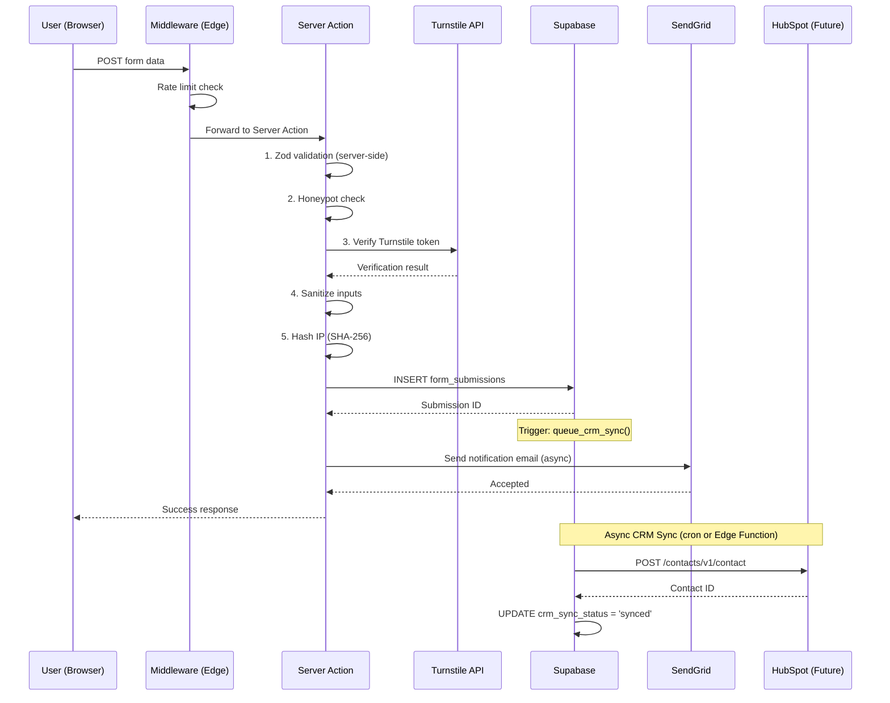

### 3.4 Data Retention Policy

| Data Type | Retention | Justification |
|---|---|---|
| Form submissions | 3 years | Sales pipeline tracking; legal compliance |
| Newsletter subscribers | Until unsubscribe + 30 days | GDPR right to erasure |
| Analytics events | 13 months | Aligned with typical analytics retention |
| A/B test assignments | 90 days post-test completion | No longer needed after analysis |
| CRM sync queue | 90 days after completion | Audit trail for failed syncs |
| Turnstile tokens | 7 days | Short-term audit; not needed long-term |
| IP hashes | 13 months (with analytics) | Cannot reverse SHA-256; low privacy risk |

---

## 4. API Design

### 4.1 Route Handler Specifications

All API routes are Next.js Route Handlers in `src/app/api/`. They use the Node.js runtime (not Edge) to support Supabase client operations, except where noted.

#### POST `/api/demo-request`

**Purpose**: Process demo request form submissions.

```typescript
// Request
{
  method: 'POST',
  headers: {
    'Content-Type': 'application/json',
  },
  body: {
    email: string,              // Required, valid email
    firstName: string,          // Required, 1-100 chars
    lastName: string,           // Required, 1-100 chars
    organization: string,       // Required, 1-200 chars
    jobTitle?: string,          // Optional, 1-100 chars
    phone?: string,             // Optional, valid phone
    segment: OrganizationSegment, // Required enum
    tripsPerYear?: number,      // Optional, 1-500
    groupSize?: number,         // Optional, 1-1000
    tripTypes?: string[],       // Optional, enum values
    timeline?: string,          // Optional: 'immediate' | '1_month' | '3_months' | '6_months'
    message?: string,           // Optional, 0-2000 chars
    turnstileToken: string,     // Required
    honeypot: string,           // Must be empty
  }
}

// Response (Success - 201)
{
  success: true,
  id: string,                   // Submission UUID
  message: "Demo request received. We will contact you within 1 business day."
}

// Response (Validation Error - 400)
{
  success: false,
  errors: Array<{ field: string, message: string }>
}

// Response (Rate Limited - 429)
{
  success: false,
  message: "Too many requests. Please try again later.",
  retryAfter: number           // Seconds
}

// Response (Bot Detected - 403)
{
  success: false,
  message: "Verification failed."
}
```

#### POST `/api/contact`

```typescript
// Request body
{
  email: string,                // Required
  firstName: string,            // Required
  lastName: string,             // Required
  organization?: string,        // Optional
  subject: string,              // Required, 1-200 chars
  message: string,              // Required, 10-5000 chars
  turnstileToken: string,       // Required
  honeypot: string,             // Must be empty
}

// Response: Same pattern as demo-request
```

#### POST `/api/newsletter`

```typescript
// Request body
{
  email: string,                // Required
  firstName?: string,           // Optional
  segment?: OrganizationSegment, // Optional
  turnstileToken: string,       // Required
  honeypot: string,             // Must be empty
}

// Response (Success - 201)
{
  success: true,
  message: "Please check your email to confirm your subscription.",
  requiresConfirmation: true
}
```

#### POST `/api/quote`

```typescript
// Request body
{
  email: string,                // Required
  firstName: string,            // Required
  lastName: string,             // Required
  organization: string,         // Required
  phone?: string,               // Optional
  segment: OrganizationSegment, // Required
  tripType: 'day_trip' | 'domestic_overnight' | 'international', // Required
  destination?: string,         // Optional
  groupSize: number,            // Required, 1-1000
  departureDate?: string,       // Optional, ISO date
  numberOfTrips?: number,       // Optional, 1-500
  specialRequirements?: string, // Optional, 0-2000 chars
  turnstileToken: string,       // Required
  honeypot: string,             // Must be empty
}
```

#### GET `/api/og`

```typescript
// Query parameters
{
  title: string,                // Page title for OG image
  subtitle?: string,            // Optional subtitle
  segment?: string,             // Optional segment badge
}

// Response
// Content-Type: image/png
// Cache-Control: public, max-age=0, s-maxage=604800
// Runtime: Edge (Satori/next-og)
```

#### POST `/api/analytics/event`

```typescript
// Request body
{
  eventName: string,            // Required: 'cta_click', 'pricing_view', etc.
  eventCategory?: string,       // Optional: 'conversion', 'engagement'
  eventData?: Record<string, unknown>, // Optional structured data
  pagePath: string,             // Required: current page path
  pageTitle?: string,
  sessionId?: string,           // Anonymous session ID from cookie
}

// Response (Success - 202 Accepted)
{
  success: true
}

// Runtime: Edge (low-latency fire-and-forget)
```

#### GET `/api/health`

```typescript
// Response (Success - 200)
{
  status: "healthy",
  timestamp: string,            // ISO 8601
  version: string,              // Git SHA or package version
  checks: {
    supabase: "connected" | "error",
    sendgrid: "configured" | "error",
    turnstile: "configured" | "error",
  }
}

// Runtime: Edge
```

### 4.2 Server Actions Specification

Server Actions are the primary form submission mechanism (progressive enhancement). They share the same validation logic as the API routes but are invoked directly from React components without a network round-trip to an API endpoint.

```typescript
// src/actions/demo-request.ts
'use server'

import { z } from 'zod'
import { createClient } from '@/lib/supabase/client'
import { verifyTurnstile } from '@/lib/turnstile/verify'
import { sendNotificationEmail } from '@/lib/email/sendgrid'
import { sanitize } from '@/lib/validation/sanitize'
import { headers } from 'next/headers'

const demoRequestSchema = z.object({
  email: z.string().email().max(254),
  firstName: z.string().min(1).max(100).transform(sanitize),
  lastName: z.string().min(1).max(100).transform(sanitize),
  organization: z.string().min(1).max(200).transform(sanitize),
  jobTitle: z.string().max(100).transform(sanitize).optional(),
  phone: z.string().max(20).optional(),
  segment: z.enum(['k12', 'higher_education', 'churches_missions', 'corporate', 'sports', 'other']),
  tripsPerYear: z.number().int().min(1).max(500).optional(),
  groupSize: z.number().int().min(1).max(1000).optional(),
  tripTypes: z.array(z.string()).optional(),
  timeline: z.enum(['immediate', '1_month', '3_months', '6_months']).optional(),
  message: z.string().max(2000).transform(sanitize).optional(),
  turnstileToken: z.string(),
  honeypot: z.string().max(0), // Must be empty
})

export type DemoRequestState = {
  success: boolean
  message: string
  errors?: Record<string, string[]>
}

export async function submitDemoRequest(
  prevState: DemoRequestState,
  formData: FormData
): Promise<DemoRequestState> {
  // 1. Parse and validate
  const parsed = demoRequestSchema.safeParse(Object.fromEntries(formData))
  if (!parsed.success) {
    return { success: false, message: 'Validation failed', errors: parsed.error.flatten().fieldErrors }
  }

  // 2. Honeypot check
  if (parsed.data.honeypot !== '') {
    // Silent rejection -- do not reveal bot detection
    return { success: true, message: 'Thank you for your submission.' }
  }

  // 3. Turnstile verification
  const turnstileResult = await verifyTurnstile(parsed.data.turnstileToken)
  if (!turnstileResult.success) {
    return { success: false, message: 'Verification failed. Please try again.' }
  }

  // 4. Hash IP
  const headerList = await headers()
  const ip = headerList.get('x-forwarded-for')?.split(',')[0] ?? 'unknown'
  const ipHash = await hashIP(ip)

  // 5. Rate limit check (10 submissions per IP per hour)
  const rateLimited = await checkRateLimit(ipHash, 'demo_request', 10, 3600)
  if (rateLimited) {
    return { success: false, message: 'Too many requests. Please try again later.' }
  }

  // 6. Insert into Supabase
  const supabase = createClient()
  const { data, error } = await supabase.from('form_submissions').insert({
    form_type: 'demo_request',
    email: parsed.data.email,
    first_name: parsed.data.firstName,
    last_name: parsed.data.lastName,
    organization: parsed.data.organization,
    job_title: parsed.data.jobTitle,
    phone: parsed.data.phone,
    segment: parsed.data.segment,
    details: {
      trips_per_year: parsed.data.tripsPerYear,
      group_size: parsed.data.groupSize,
      trip_types: parsed.data.tripTypes,
      timeline: parsed.data.timeline,
      message: parsed.data.message,
    },
    ip_hash: ipHash,
    country_code: headerList.get('x-vercel-ip-country') ?? null,
    utm_source: headerList.get('x-utm-source') ?? null,
    // ... additional UTM params from cookie/header
  }).select('id').single()

  if (error) {
    console.error('Supabase insert error:', error)
    return { success: false, message: 'Something went wrong. Please try again.' }
  }

  // 7. Send notification email (non-blocking)
  sendNotificationEmail({
    type: 'demo_request',
    to: 'sales@safetrekr.com',
    data: parsed.data,
    submissionId: data.id,
  }).catch(console.error)

  return {
    success: true,
    message: 'Demo request received. We will contact you within 1 business day.',
  }
}
```

---

## 5. Security Architecture

### 5.1 Security Headers (Middleware)

```typescript
// middleware.ts -- Security headers applied to every response

const securityHeaders = [
  // Content Security Policy
  {
    key: 'Content-Security-Policy',
    value: [
      "default-src 'self'",
      "script-src 'self' 'unsafe-inline' 'unsafe-eval' https://challenges.cloudflare.com https://plausible.io",
      "style-src 'self' 'unsafe-inline'",
      "img-src 'self' data: blob: https://api.maptiler.com https://*.tile.openstreetmap.org",
      "font-src 'self'",
      "connect-src 'self' https://*.supabase.co https://plausible.io https://challenges.cloudflare.com https://api.maptiler.com",
      "frame-src https://challenges.cloudflare.com",
      "frame-ancestors 'none'",
      "base-uri 'self'",
      "form-action 'self'",
      "object-src 'none'",
      "upgrade-insecure-requests",
    ].join('; '),
  },
  // Prevent clickjacking
  { key: 'X-Frame-Options', value: 'DENY' },
  // Prevent MIME sniffing
  { key: 'X-Content-Type-Options', value: 'nosniff' },
  // Referrer policy
  { key: 'Referrer-Policy', value: 'strict-origin-when-cross-origin' },
  // HSTS (also set at Cloudflare level)
  { key: 'Strict-Transport-Security', value: 'max-age=31536000; includeSubDomains; preload' },
  // Permissions policy
  {
    key: 'Permissions-Policy',
    value: [
      'camera=()',
      'microphone=()',
      'geolocation=()',
      'interest-cohort=()',    // Block FLoC
      'payment=()',
      'usb=()',
      'magnetometer=()',
      'gyroscope=()',
      'accelerometer=()',
    ].join(', '),
  },
  // Cross-Origin policies
  { key: 'Cross-Origin-Embedder-Policy', value: 'unsafe-none' }, // Required for MapLibre workers
  { key: 'Cross-Origin-Opener-Policy', value: 'same-origin' },
  { key: 'Cross-Origin-Resource-Policy', value: 'same-site' },
  // DNS prefetch control
  { key: 'X-DNS-Prefetch-Control', value: 'on' },
]
```

### 5.2 Eight-Layer Form Security

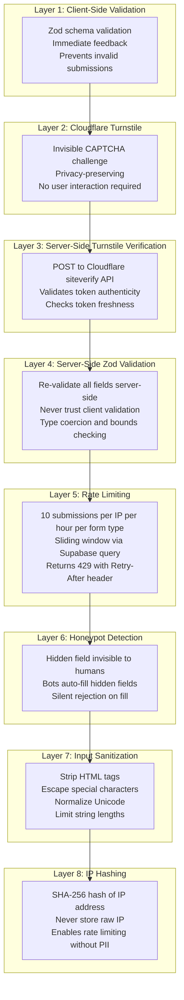

### 5.3 Rate Limiting Implementation

```typescript
// Rate limiting via Supabase query (no Redis dependency)
async function checkRateLimit(
  ipHash: string,
  formType: string,
  maxRequests: number,
  windowSeconds: number
): Promise<boolean> {
  const supabase = createClient()
  const windowStart = new Date(Date.now() - windowSeconds * 1000).toISOString()

  const { count } = await supabase
    .from('form_submissions')
    .select('*', { count: 'exact', head: true })
    .eq('ip_hash', ipHash)
    .eq('form_type', formType)
    .gte('created_at', windowStart)

  return (count ?? 0) >= maxRequests
}
```

**Rate Limit Thresholds:**

| Form Type | Max Requests | Window | Rationale |
|---|---|---|---|
| Demo request | 5 | 1 hour | High-value form; low legitimate volume |
| Quote request | 5 | 1 hour | Same as demo |
| Contact form | 10 | 1 hour | Slightly more permissive |
| Newsletter signup | 3 | 1 hour | Single email per person |
| Analytics event | 100 | 1 minute | Higher volume but still bounded |
| Global per IP | 50 | 5 minutes | Catch-all rate limit |

### 5.4 Supply Chain Security

| Control | Implementation |
|---|---|
| Lock files committed | `pnpm-lock.yaml` committed; CI fails on inconsistency |
| Dependency scanning | `npm audit` in CI; Dependabot alerts enabled |
| SRI for external scripts | Plausible script loaded with integrity hash |
| No eval/inline JS | CSP enforced (except Turnstile which requires it) |
| Environment isolation | `.env.local` in `.gitignore`; Vercel encrypted env vars |
| Secret rotation | Supabase keys rotatable; SendGrid key scoped to send-only |
| SBOM generation | `npx @cyclonedx/bom` in CI pipeline |

### 5.5 Authentication & Authorization Model

The marketing site has **no user authentication**. All API routes use the Supabase `service_role` key server-side. Row Level Security policies ensure that even if the anon key leaked, no data is accessible from the client.

Future self-service signup will use Supabase Auth on the product database (app.safetrekr.com), not the marketing database. The marketing site will redirect to `app.safetrekr.com/signup` with UTM parameters preserved.

---

## 6. Performance Architecture

### 6.1 Performance Budget

| Metric | Target | Enforcement | Measurement |
|---|---|---|---|
| Largest Contentful Paint (LCP) | < 1.2s | Lighthouse CI in PR check | Vercel Web Analytics |
| First Input Delay (FID) / INP | < 50ms | Lighthouse CI | Vercel Web Analytics |
| Cumulative Layout Shift (CLS) | < 0.05 | Lighthouse CI | Vercel Web Analytics |
| Time to First Byte (TTFB) | < 100ms | Vercel Edge (SSG guarantee) | Vercel Analytics |
| Total Page Weight (initial) | < 500 KB | Bundlewatch in CI | Bundle analysis |
| JavaScript Bundle (initial) | < 150 KB gzipped | Bundlewatch in CI | `next build` output |
| MapLibre (lazy-loaded) | < 200 KB gzipped | Bundlewatch | Dynamic import analysis |
| Framer Motion (tree-shaken) | < 15 KB gzipped | Bundlewatch | Import analysis |
| Lighthouse Performance Score | >= 95 | Lighthouse CI | Automated in CI |
| Lighthouse Accessibility Score | >= 95 | Lighthouse CI, axe-core | Automated in CI |

### 6.2 Bundle Optimization Strategy

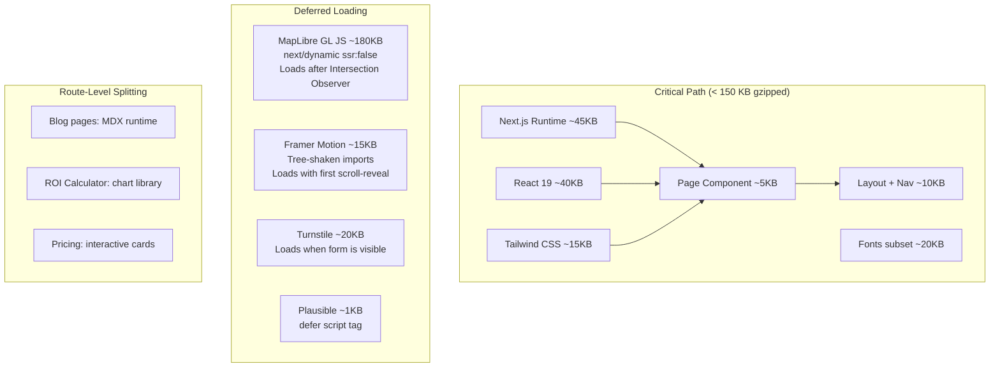

### 6.3 Image Optimization Strategy

| Context | Format | Sizing | Loading |
|---|---|---|---|
| Hero composition | WebP/AVIF | 1200px max, responsive srcset | `priority` (LCP element) |
| Feature icons/illustrations | SVG inline or sprite | Fixed size | Eager (above fold) |
| Logo variants | SVG | Multiple sizes per viewport | Eager (in header) |
| Blog post images | WebP/AVIF | 800px max content width | `loading="lazy"` |
| Map static fallback | WebP | 1200px, responsive | `priority` (hero map) |
| OG images | PNG | 1200x630 | Generated on demand |

**`next/image` configuration** handles format negotiation (AVIF preferred, WebP fallback), responsive srcsets, and Vercel Image Optimization CDN caching.

### 6.4 Font Optimization

```typescript
// src/lib/fonts.ts
import { Plus_Jakarta_Sans, Inter, JetBrains_Mono } from 'next/font/google'

export const plusJakarta = Plus_Jakarta_Sans({
  subsets: ['latin'],
  display: 'swap',
  variable: '--font-display',
  weight: ['600', '700', '800'],  // Only weights used
})

export const inter = Inter({
  subsets: ['latin'],
  display: 'swap',
  variable: '--font-body',
  weight: ['400', '500'],
})

export const jetbrainsMono = JetBrains_Mono({
  subsets: ['latin'],
  display: 'swap',
  variable: '--font-mono',
  weight: ['400', '500'],
})
```

`next/font` self-hosts fonts, eliminating external requests to Google Fonts. Font files are hashed and served with immutable cache headers.

### 6.5 Rendering Performance Patterns

**Pattern: Static Shell with Client Island (MapLibre)**

```
1. Server renders static HTML with  fallback of map
2. Client detects Intersection Observer trigger
3. next/dynamic loads MapLibre GL JS chunk (~180KB)
4. Interactive map crossfades over static image
5. No layout shift (same dimensions, position: absolute overlay)
```

**Pattern: Progressive Form Enhancement**

```
1. Server renders <form> with action={serverAction}
2. Form works without JavaScript (progressive enhancement)
3. Client hydrates: React Hook Form takes over
4. Turnstile widget loads when form enters viewport
5. Real-time validation displays on blur/change
```

**Pattern: Scroll-Triggered Animation Loading**

```
1. Server renders static content (no animation classes)
2. Intersection Observer detects element entering viewport
3. Framer Motion chunk loads (if not already cached)
4. Animation plays once, then unmounts observer
5. prefers-reduced-motion: skip animation, show content immediately
```

---

## 7. Observability Architecture

### 7.1 Monitoring Stack

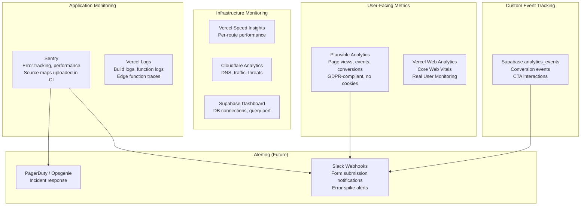

### 7.2 Error Tracking (Sentry)

```typescript
// Sentry configuration in next.config.ts (via @sentry/nextjs)
const sentryConfig = {
  dsn: process.env.SENTRY_DSN,
  tracesSampleRate: 0.1,        // 10% of transactions
  replaysSessionSampleRate: 0,   // No session replay (privacy)
  replaysOnErrorSampleRate: 0.5, // 50% replay on errors
  environment: process.env.VERCEL_ENV ?? 'development',
  release: process.env.VERCEL_GIT_COMMIT_SHA,

  // Source maps uploaded via Sentry Vercel integration
  // Automatically strips them from production builds
}
```

**Alert Rules:**

| Alert | Condition | Severity | Notification |
|---|---|---|---|
| Error spike | > 10 errors in 5 minutes | Critical | PagerDuty + Slack |
| Form submission failure | Any 500 on `/api/demo-request` | High | Slack `#alerts` |
| Performance degradation | LCP p95 > 2.5s for 15 minutes | Medium | Slack `#perf` |
| Unhandled promise rejection | Any occurrence | Medium | Sentry digest email |
| CSP violation report | > 5 reports in 1 hour | Low | Sentry + weekly review |

### 7.3 Analytics Event Taxonomy

| Event Name | Category | Trigger | Data |
|---|---|---|---|
| `cta_click` | conversion | CTA button click | `{ ctaType, ctaText, pageSection }` |
| `form_start` | conversion | First form field focus | `{ formType }` |
| `form_submit` | conversion | Successful form submission | `{ formType, segment }` |
| `form_error` | conversion | Form submission failure | `{ formType, errorType }` |
| `demo_request` | conversion | Demo form submission | `{ segment, timeline }` |
| `sample_binder_download` | conversion | Binder PDF download | `{ binderType, segment }` |
| `roi_calculator_complete` | conversion | ROI calculation finished | `{ savings, tripsPerYear }` |
| `pricing_view` | engagement | Pricing page visible 3s | `{ segment }` |
| `scroll_depth` | engagement | 25%, 50%, 75%, 100% thresholds | `{ depth, pagePath }` |
| `video_play` | engagement | Video play button click | `{ videoId, pageSection }` |
| `segment_select` | navigation | Segment selector interaction | `{ selectedSegment }` |
| `nav_click` | navigation | Primary nav item click | `{ navItem, isMobile }` |
| `exit_intent_shown` | engagement | Exit intent popup displayed | `{ pagePath }` |
| `procurement_download` | conversion | W-9 or doc download | `{ documentType }` |
| `comparison_view` | engagement | Comparison table visible 3s | `{ comparisons }` |

### 7.4 Health Check Endpoint

The `/api/health` endpoint enables external monitoring services (UptimeRobot, Vercel Checks) to verify system health:

```typescript
// Checks performed:
// 1. Supabase connectivity (SELECT 1)
// 2. SendGrid API key validity (GET /v3/scopes)
// 3. Turnstile secret key configured
// 4. Build metadata present (version, commit SHA)
// Returns 200 if all pass, 503 if any critical check fails
```

---

## 8. Integration Architecture

### 8.1 Integration Landscape

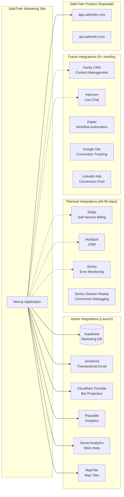

### 8.2 Integration Contracts

#### Supabase (Marketing DB)

| Aspect | Detail |
|---|---|
| Client library | `@supabase/supabase-js` v2 |
| Auth mode | `service_role` key (server-side only) |
| Connection | REST API via PostgREST (no direct Postgres) |
| Connection pooling | Supavisor (Supabase-managed, included in Pro) |
| RLS | Enabled; all tables locked to service_role |
| Realtime | Not used (no live data requirements) |
| Storage | Not used at launch (PDFs served from `/public`) |
| Edge Functions | Planned for CRM sync cron job |

#### SendGrid

| Aspect | Detail |
|---|---|
| API version | v3 |
| Scoped permissions | `mail.send` only (least privilege) |
| Templates | Dynamic templates stored in SendGrid |
| Sender | `noreply@safetrekr.com` (verified domain) |
| Rate limit | 100 emails/day (free tier) -> 50,000/month (Pro) |
| Webhooks | Event webhooks for bounce/complaint handling (future) |

**Email Templates:**

| Template | Trigger | Recipients |
|---|---|---|
| Demo request notification | New demo form submission | `sales@safetrekr.com` |
| Demo request confirmation | Same | Submitter's email |
| Quote request notification | New quote submission | `sales@safetrekr.com` |
| Contact form notification | New contact submission | `info@safetrekr.com` |
| Newsletter welcome | Confirmed subscription | Subscriber |
| Newsletter double opt-in | New signup | Subscriber |

#### Cloudflare Turnstile

| Aspect | Detail |
|---|---|
| Widget mode | Invisible (managed challenge) |
| Site key | `NEXT_PUBLIC_TURNSTILE_SITE_KEY` (client-side) |
| Secret key | `TURNSTILE_SECRET_KEY` (server-side only) |
| Verification | `POST https://challenges.cloudflare.com/turnstile/v0/siteverify` |
| Token lifetime | 300 seconds (5 minutes) |
| Failure handling | Retry with visible challenge; block after 3 failures |

#### Plausible Analytics

| Aspect | Detail |
|---|---|
| Plan | Growth ($9/month; 10K monthly pageviews) |
| Script | `https://plausible.io/js/script.tagged-events.js` |
| Custom domain | Optional: `plausible.safetrekr.com` CNAME proxy |
| Goals | `Demo Request`, `Contact Submit`, `Binder Download`, `Newsletter Signup` |
| Custom properties | `segment`, `page_section`, `cta_type` |
| API | Stats API for internal dashboards (future) |

### 8.3 Product App Integration Points

The marketing site and product app are fully independent applications. Integration occurs at three points:

| Integration Point | Mechanism | Detail |
|---|---|---|
| Shared domain | Cookie scope `.safetrekr.com` | Enables SSO token sharing when self-service ships |
| Login redirect | `<a href="https://app.safetrekr.com/login">` | Simple hyperlink; no API call |
| UTM passthrough | URL parameters | Marketing UTMs passed to `app.safetrekr.com/signup?utm_source=...` |
| Pricing data | None (hardcoded) | Pricing on marketing site is manually maintained; Stripe integration will sync pricing |

### 8.4 CRM Integration Architecture (HubSpot -- Planned)

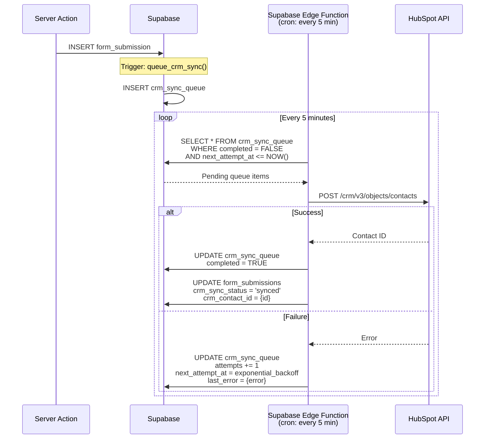

**Retry Logic:**
- Attempt 1: Immediate
- Attempt 2: 5 minutes
- Attempt 3: 30 minutes
- Attempt 4: 2 hours
- Attempt 5: 12 hours
- After 5 failures: Mark as `failed`, alert via Slack

### 8.5 Stripe Integration Architecture (Planned)

```
Phase 1 (Launch): Static pricing page with hardcoded prices
Phase 2 (60 days): Stripe Checkout session creation from pricing page
Phase 3 (90 days): Full self-service with Stripe Customer Portal

Integration Pattern:
- Marketing site creates Stripe Checkout Sessions via API route
- Checkout happens on Stripe-hosted page (PCI compliance)
- Webhook at /api/webhooks/stripe handles payment confirmation
- Redirect back to app.safetrekr.com/onboarding after payment
- No payment data stored in marketing database
```

---

## 9. Deployment Pipeline

### 9.1 Environment Strategy

| Environment | Branch | URL | Purpose |
|---|---|---|---|
| Production | `main` | `safetrekr.com` | Live site |
| Staging | `staging` | `staging.safetrekr.com` | Pre-production validation |
| Preview | Any PR | `*.vercel.app` | Feature review |
| Local | N/A | `localhost:3000` | Development |

### 9.2 CI/CD Pipeline

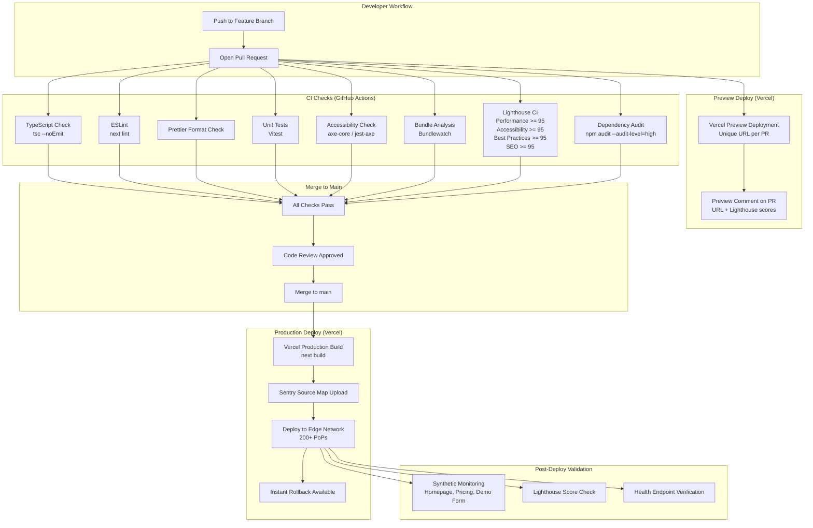

### 9.3 Rollback Strategy

| Scenario | Action | Time to Recovery |
|---|---|---|
| Visual regression detected | Vercel instant rollback to previous deployment | < 30 seconds |
| API route error spike | Vercel instant rollback | < 30 seconds |
| Database migration issue | Supabase point-in-time recovery | < 10 minutes |
| Third-party service outage | Feature flags disable affected integration | < 2 minutes |
| DNS issue | Cloudflare dashboard DNS update | < 5 minutes |

Vercel retains all previous deployments. Any deployment can be promoted to production instantly without rebuilding.

### 9.4 Environment Variables Management

| Variable | Production | Staging | Preview | Local |
|---|---|---|---|---|
| `SUPABASE_URL` | Production Supabase | Staging Supabase | Staging Supabase | Local Supabase |
| `SUPABASE_SERVICE_ROLE_KEY` | Prod key | Staging key | Staging key | Local key |
| `SENDGRID_API_KEY` | Prod SendGrid | Sandbox SendGrid | Sandbox | Sandbox |
| `TURNSTILE_SECRET_KEY` | Prod Turnstile | Test key | Test key | Test key |
| `NEXT_PUBLIC_TURNSTILE_SITE_KEY` | Prod key | Test key | Test key | Test key |
| `SENTRY_DSN` | Prod DSN | Staging DSN | Staging DSN | None |
| `NEXT_PUBLIC_PLAUSIBLE_DOMAIN` | `safetrekr.com` | `staging.safetrekr.com` | None | None |

All sensitive variables are stored in Vercel's encrypted environment variable store. They are never committed to source control.

---

## 10. Compliance Architecture

### 10.1 GDPR Compliance

| Requirement | Implementation |
|---|---|
| Lawful basis for processing | Consent (form submission = explicit consent); Legitimate interest (analytics) |
| Data minimization | Forms collect only what is needed; no optional fields required |
| Right to access | Supabase query by email; exportable via admin API (future) |
| Right to erasure | DELETE from form_submissions WHERE email = X; cascade to newsletter, events |
| Right to portability | JSON export of all data associated with an email address |
| Cookie consent | Not required for Plausible (cookieless); required only if GA4 is enabled |
| Privacy policy | `/legal/privacy` -- comprehensive, plain-language, updated quarterly |
| DPA | `/legal/dpa` -- Data Processing Agreement for institutional buyers |
| Data breach notification | Sentry + Slack alerts for anomalous data access patterns |
| Cross-border transfer | Supabase in US East; Cloudflare proxies globally but does not store PII |

### 10.2 CCPA Compliance

| Requirement | Implementation |
|---|---|
| Notice at collection | Privacy policy linked from every form; clear data usage statement |
| Right to know | Email-based data export (same as GDPR access) |
| Right to delete | Same as GDPR erasure |
| Right to opt-out of sale | SafeTrekr does not sell data; statement in privacy policy |
| Non-discrimination | No service difference based on privacy choices |
| "Do Not Sell" link | Footer link to privacy policy with opt-out instructions |

### 10.3 WCAG 2.2 AA Compliance

| Category | Requirements | Implementation |
|---|---|---|
| Perceivable | Color contrast >= 4.5:1 (normal), >= 3:1 (large) | Tailwind CSS tokens enforce ratios; CI lint |
| | Alt text for all images | ESLint `jsx-a11y` enforces alt props |
| | Captions for video content | When video ships, WebVTT captions required |
| Operable | Keyboard navigable | Tab order tested; skip-nav link; focus-visible styles |
| | No keyboard traps | Tested in forms, dialogs, mobile nav |
| | Sufficient time | No auto-advancing content; motion respects `prefers-reduced-motion` |
| Understandable | Clear language | Reading level target: Grade 8 (Flesch-Kincaid) |
| | Consistent navigation | Same header/footer on every page |
| | Error identification | Form errors linked to specific fields with aria-describedby |
| Robust | Valid HTML | Semantic elements; tested with axe-core |
| | ARIA landmarks | `<main>`, `<nav>`, `<header>`, `<footer>`, `role` attributes |

**Accessibility Testing Matrix:**

| Tool | When | What |
|---|---|---|
| axe-core (jest-axe) | CI on every PR | Automated accessibility violations |
| Lighthouse Accessibility | CI on every PR | Score >= 95 required |
| Manual keyboard testing | Pre-launch, monthly | Tab order, focus management, skip-nav |
| Screen reader testing | Pre-launch, quarterly | VoiceOver (macOS), NVDA (Windows) |
| Color contrast analyzer | Design system creation | All token combinations verified |

### 10.4 Cookie Consent Architecture

**Primary Mode (Plausible Only):**
- No cookies set by analytics
- No cookie consent banner needed
- Plausible uses no cookies, no localStorage, no fingerprinting
- Full GDPR/CCPA compliance without user interaction

**Optional Mode (GA4 Enabled):**
- Cookie consent banner appears on first visit
- GA4 scripts load ONLY after explicit opt-in
- Consent state stored in `localStorage` (not a cookie)
- Consent applies to: GA4, Google Ads pixel, LinkedIn pixel
- Consent does NOT apply to: Plausible (always active, no consent needed)

```typescript
// Cookie consent tiers
type ConsentTier = {
  necessary: true           // Always true; session functionality
  analytics: boolean        // Plausible: always on; GA4: requires consent
  marketing: boolean        // Ad pixels: requires consent
  preferences: boolean      // Theme, language: requires consent
}
```

### 10.5 Section 508 (K-12 Procurement Requirement)

Section 508 compliance (required for US federal and many K-12 contracts) is largely satisfied by WCAG 2.2 AA compliance. Additional requirements:

| Requirement | Implementation |
|---|---|
| Electronic documents accessible | Sample binder PDFs tagged for screen readers |
| Multimedia alternatives | Video captions + transcripts |
| No flashing content | No animations faster than 3 flashes/second |
| Text alternatives | All decorative SVGs have `aria-hidden="true"` |
| Consistent identification | Components use consistent ARIA patterns |

### 10.6 Compliance Documentation for Procurement

The `/procurement` page serves as a compliance resource center:

| Document | Format | Purpose |
|---|---|---|
| W-9 | PDF download | Tax identification |
| Certificate of Insurance | PDF download | Liability coverage proof |
| Security Questionnaire | PDF download | Pre-filled CAIQ/SIG-Lite |
| VPAT (Voluntary Product Accessibility Template) | HTML + PDF | Section 508/WCAG compliance statement |
| Data Processing Agreement | HTML + PDF | GDPR DPA for EU organizations |
| Privacy Impact Assessment | PDF | Data handling documentation |
| SOC 2 Status | HTML | Current certification status |
| Penetration Test Summary | PDF (redacted) | Security posture evidence |

---

## 11. Enhancement Proposals

### Enhancement 1: Vercel Edge Config for Real-Time Feature Flags

**Problem**: Currently, feature toggles (self-service CTA, GA4 loading, exit-intent popup) require code changes and redeploys.

**Proposal**: Implement Vercel Edge Config as a low-latency key-value store read from middleware at the edge.

**Architecture**:
```
Vercel Edge Config Store
  ├── self_service_enabled: false -> true (60-day toggle)
  ├── ga4_enabled: false (enable after cookie consent ships)
  ├── exit_intent_enabled: true
  ├── maintenance_mode: false
  ├── hero_variant: 'analyst_review' | 'sample_binder' (A/B test)
  └── pricing_display: 'per_student' | 'per_trip'
```

**Benefits**:
- Sub-millisecond reads at the edge (no cold start)
- No redeploy needed for flag changes
- Enables A/B testing without middleware complexity
- Feature rollout can be controlled by non-engineers via Vercel dashboard

**Cost**: Included in Vercel Pro ($20/month)

**Priority**: P1 -- Ship before self-service launch

---

### Enhancement 2: Supabase Edge Functions for Form Processing

**Problem**: API route handlers run on Vercel serverless functions (Node.js runtime) with cold starts of 100-500ms. Form submissions to Supabase cross from Vercel's US East to Supabase's US East, but the processing logic (validation, Turnstile verification, email sending) adds latency.

**Proposal**: Move form processing to Supabase Edge Functions (Deno runtime) that execute closer to the database.

**Architecture**:
```
Browser -> Vercel Edge (headers only) -> Supabase Edge Function (form processing)
  ├── Validate with Zod
  ├── Verify Turnstile
  ├── Check rate limits (direct DB query, no network hop)
  ├── Insert form_submissions (same-datacenter, ~1ms)
  ├── Trigger email via SendGrid
  └── Return response
```

**Benefits**:
- Eliminates Vercel cold start for form submissions
- Database operations are same-datacenter (< 1ms vs. ~10ms)
- Independent scaling from the marketing site
- Supabase Edge Functions have no cold start on the Pro plan

**Tradeoff**: Introduces a second runtime (Deno) and deployment target. Evaluate at the point where form submission latency exceeds 500ms p95.

**Priority**: P2 -- Evaluate after launch based on observed latency

---

### Enhancement 3: Webhook-Based CRM Sync with Exponential Backoff Retry

**Problem**: HubSpot integration planned as P2 requires reliable async sync of form submissions without blocking the user-facing form flow.

**Proposal**: Implement a queue-based sync pattern using Supabase's `crm_sync_queue` table (defined in schema above) with a Supabase Edge Function cron job.

**Architecture** (detailed in Section 8.4):
- Database trigger creates queue entry on every form submission
- Supabase Edge Function runs every 5 minutes
- Exponential backoff: 0m, 5m, 30m, 2h, 12h
- Dead letter after 5 failures with Slack alert
- Idempotent: uses email as dedup key in HubSpot

**Benefits**:
- Zero impact on form submission latency
- Automatic retry on transient HubSpot API failures
- Full audit trail in `crm_sync_queue` table
- Can be extended to sync with multiple CRMs

**Cost**: Supabase Edge Function invocations included in Pro plan

**Priority**: P2 -- Implement when HubSpot account is provisioned

---

### Enhancement 4: Automated SSL/TLS Certificate Management

**Problem**: Manual certificate management creates renewal risk and operational overhead.

**Proposal**: Use Vercel's automatic SSL with Cloudflare's origin certificates for a zero-maintenance TLS stack.

**Architecture**:
```
Browser <-> Cloudflare (edge TLS termination, auto-renewed)
  ├── Cloudflare Universal SSL (free, auto-renewed)
  ├── Minimum TLS 1.2 enforced
  └── HSTS preload submitted

Cloudflare <-> Vercel (origin TLS)
  ├── Cloudflare Origin Certificate (15-year validity)
  ├── Full (Strict) SSL mode
  └── Authenticated Origin Pulls (optional hardening)

Vercel:
  ├── Auto-provisions Let's Encrypt certificates for custom domains
  ├── Auto-renewal 30 days before expiry
  └── OCSP stapling enabled
```

**Benefits**:
- Zero certificate management overhead
- Dual-layer TLS (Cloudflare edge + Vercel origin)
- HSTS preload prevents downgrade attacks
- Certificate Transparency monitoring via Cloudflare

**Implementation**: This is configuration-only, no code changes.

**Priority**: P0 -- Configure during initial DNS setup

---

### Enhancement 5: Geographic Routing for International Visitors

**Problem**: SafeTrekr serves international mission trips and study abroad programs. Visitors from non-US locations may need region-specific content (EU privacy notice, local compliance information).

**Proposal**: Use Vercel's geo headers in middleware to customize content delivery.

**Architecture**:
```typescript
// middleware.ts
export function middleware(request: NextRequest) {
  const country = request.geo?.country ?? 'US'
  const response = NextResponse.next()

  // Set geo header for downstream components
  response.headers.set('x-user-country', country)

  // EU visitors: show GDPR-specific privacy notice
  if (EU_COUNTRIES.includes(country)) {
    response.headers.set('x-privacy-region', 'eu')
  }

  // Future: redirect to localized content
  // if (country === 'GB') response.rewrite('/uk/...')

  return response
}
```

**Phase 1** (Launch): Pass country code to analytics events and form submissions for geographic lead scoring.

**Phase 2** (6 months): Display region-specific compliance badges and privacy notices.

**Phase 3** (12 months): Localized content for UK, AU, CA markets if international expansion warrants it.

**Priority**: P1 -- Geographic data in analytics is immediately valuable for sales

---

### Enhancement 6: Supabase Connection Pooling via Supavisor

**Problem**: Serverless functions create a new database connection per invocation. Under traffic spikes (back-to-school season, conference mentions), connection exhaustion can occur.

**Proposal**: Use Supabase's built-in Supavisor connection pooler, which is included in the Pro plan.

**Architecture**:
```
Vercel Serverless Functions (potentially 100+ concurrent)
  └── Supavisor Connection Pooler (PgBouncer-compatible)
      ├── Transaction mode (default, best for serverless)
      ├── Max 60 connections to Postgres (Pro plan)
      ├── Thousands of concurrent clients supported
      └── Connection string: use pooler URL, not direct URL
```

**Configuration**:
```typescript
// lib/supabase/client.ts
import { createClient } from '@supabase/supabase-js'

// Use the pooler URL, not the direct connection URL
const supabaseUrl = process.env.SUPABASE_URL!
const supabaseKey = process.env.SUPABASE_SERVICE_ROLE_KEY!

export const supabase = createClient(supabaseUrl, supabaseKey, {
  db: {
    schema: 'public',
  },
  auth: {
    persistSession: false, // Server-side only; no session persistence
    autoRefreshToken: false,
  },
})
```

**Benefits**:
- Handles traffic spikes without connection exhaustion
- Zero configuration (Supavisor is default on Supabase Pro)
- Transaction-mode pooling is ideal for serverless

**Priority**: P0 -- Use pooler URL from day one

---

### Enhancement 7: Automated Backup Strategy for Form Data

**Problem**: Form submissions represent potential revenue (demo requests, quotes). Data loss is unacceptable.

**Proposal**: Multi-layer backup strategy using Supabase's built-in features plus an additional export layer.

**Architecture**:
```
Layer 1: Supabase Point-in-Time Recovery (PITR)
  ├── Included in Pro plan
  ├── Continuous WAL archiving to S3
  ├── Restore to any point in the last 7 days
  └── RPO: seconds (WAL-based)

Layer 2: Supabase Daily Backups
  ├── Automatic daily snapshots
  ├── Retained for 7 days (Pro)
  └── Downloadable from dashboard

Layer 3: Weekly CSV Export (Supabase Edge Function)
  ├── Cron: Every Sunday 02:00 UTC
  ├── Export form_submissions, newsletter_subscribers
  ├── Encrypt with GPG
  ├── Upload to Supabase Storage or external S3 bucket
  └── Retain for 90 days

Layer 4: Real-Time Email Copy
  ├── Every form submission sends notification email
  ├── Email serves as secondary record
  └── SendGrid retains message history for 30 days
```

**Recovery Time Objectives:**

| Scenario | RTO | RPO | Method |
|---|---|---|---|
| Accidental row deletion | < 5 minutes | Seconds | PITR restore |
| Table corruption | < 30 minutes | Seconds | PITR restore |
| Full database loss | < 2 hours | < 24 hours | Daily backup restore |
| Supabase region outage | < 4 hours | < 7 days | CSV export + schema migration to new project |

**Priority**: P1 -- Configure PITR and daily backups at launch; weekly export in month 2

---

### Enhancement 8: Content Delivery Optimization (Stale-While-Revalidate)

**Problem**: ISR pages (blog) can serve stale content during revalidation, but the first visitor after revalidation expiry gets a slower response.

**Proposal**: Implement a multi-layer caching strategy with SWR patterns.

**Architecture**:
```
Layer 1: Vercel Edge Cache (CDN)
  ├── SSG pages: cached until next deploy (immutable)
  ├── ISR pages: cached for revalidation period
  ├── s-maxage=3600, stale-while-revalidate=86400
  └── First visitor after expiry gets stale; revalidation happens async

Layer 2: On-Demand Revalidation
  ├── POST /api/revalidate?tag=blog (webhook from CMS)
  ├── Instantly purges specific cached pages
  ├── No wait for revalidation timer
  └── Used when blog posts are published/updated

Layer 3: Preload Critical Routes
  ├── next.config.ts: experimental.ppr (Partial Prerendering)
  ├── Static shell served instantly
  ├── Dynamic parts stream in
  └── Reduces perceived latency for hybrid pages

Layer 4: Client-Side Prefetching
  ├── <Link> components auto-prefetch on hover
  ├── Segment pages prefetched from homepage
  ├── Pricing prefetched from solutions pages
  └── Improves perceived navigation speed
```

**Cache Headers for ISR Pages:**
```
Cache-Control: public, max-age=0, s-maxage=3600, stale-while-revalidate=86400
```
This serves cached content for 1 hour, then serves stale content for up to 24 hours while revalidating in the background.

**Priority**: P1 -- Configure at build time; on-demand revalidation when CMS ships

---

### Enhancement 9: Security Headers Automation via Middleware

**Problem**: Security headers must be consistent across all routes, including API routes, static assets, and dynamic pages. Manual configuration per-route is error-prone.

**Proposal**: Centralize all security header injection in Next.js middleware with automated testing.

**Architecture**:
```typescript
// middleware.ts -- single source of truth for security headers
// Applied to every request via matcher configuration

// Additional hardening beyond base headers:

// 1. CSP Reporting
{
  key: 'Report-To',
  value: JSON.stringify({
    group: 'csp-violations',
    max_age: 10886400,
    endpoints: [{ url: '/api/csp-report' }],
  }),
}

// 2. CSP Report-Only mode for testing
// Deploy new CSP in report-only first, monitor for 7 days, then enforce
{
  key: 'Content-Security-Policy-Report-Only',
  value: newCspPolicy,
}

// 3. NEL (Network Error Logging)
{
  key: 'NEL',
  value: JSON.stringify({
    report_to: 'network-errors',
    max_age: 2592000,
  }),
}
```

**CI Enforcement:**
```yaml
# .github/workflows/security-headers.yml
- name: Verify Security Headers
  run: |
    # Deploy preview URL
    URL="${{ steps.deploy.outputs.preview-url }}"
    # Check all required headers exist
    npx is-website-secure "$URL" --strict
    # Custom header validation
    node scripts/verify-security-headers.mjs "$URL"
```

**Priority**: P0 -- Implement in middleware from day one; CI check from week 2

---

### Enhancement 10: Incident Response Automation

**Problem**: The marketing site is the primary lead generation channel. Downtime or form submission failures directly impact revenue.

**Proposal**: Implement automated incident detection, escalation, and recovery.

**Architecture**:
```mermaid
graph TD
    subgraph "Detection Layer"
        V1[Vercel Checks<br/>Build + Deploy health]
        S1[Sentry Alerts<br/>Error rate thresholds]
        U1[UptimeRobot<br/>Synthetic monitoring every 60s]
        H1[/api/health endpoint<br/>Supabase + SendGrid checks]
    end

    subgraph "Alerting Layer"
        SL[Slack #marketing-alerts<br/>All incidents]
        EM[Email escalation<br/>P1 and above]
        PD[PagerDuty<br/>P0 critical only]
    end

    subgraph "Response Runbooks"
        R1[Form submission failures<br/>1. Check Supabase status<br/>2. Verify SendGrid key<br/>3. Check Turnstile status<br/>4. Rollback if code change]
        R2[Performance degradation<br/>1. Check Vercel status<br/>2. Review recent deploys<br/>3. Check third-party status<br/>4. Purge CDN cache]
        R3[Full outage<br/>1. Rollback to last deploy<br/>2. Check DNS<br/>3. Check Cloudflare status<br/>4. Failover static page]
    end

    V1 --> SL
    S1 --> SL
    S1 --> PD
    U1 --> SL
    U1 --> EM
    H1 --> U1
    SL --> R1
    SL --> R2
    PD --> R3
```

**Incident Severity Matrix:**

| Severity | Definition | Response Time | Notification |
|---|---|---|---|
| P0 (Critical) | Site fully down; forms non-functional | < 15 minutes | PagerDuty + Slack + Email |
| P1 (High) | Partial functionality loss; one form type broken | < 1 hour | Slack + Email |
| P2 (Medium) | Performance degradation; LCP > 3s | < 4 hours | Slack |
| P3 (Low) | Minor visual issue; non-critical bug | Next business day | Slack |

**Priority**: P2 -- UptimeRobot from launch; Sentry + PagerDuty integration in month 2

---

### Enhancement 11: Automated Sitemap and SEO Health Monitoring

**Problem**: SEO is the primary organic acquisition channel. Broken links, missing metadata, or sitemap errors directly impact search visibility.

**Proposal**: Implement automated SEO monitoring in CI and production.

**Architecture**:
```
CI Pipeline:
  ├── Validate sitemap.xml output (all pages listed, valid URLs)
  ├── Check all pages have unique <title> and <meta description>
  ├── Verify JSON-LD structured data with schema.org validator
  ├── Check for broken internal links
  ├── Verify robots.txt allows AI crawlers
  └── Validate OG image generation for each page

Production Monitoring:
  ├── Weekly Google Search Console API check (coverage errors)
  ├── Monthly Lighthouse CI run on top 20 pages
  ├── Automated broken link checker (Supabase Edge Function cron)
  └── AI citation monitoring (manual check of Perplexity, ChatGPT)
```

**Priority**: P1 -- CI checks from week 2; production monitoring from month 2

---

### Enhancement 12: Database Row-Level Encryption for Sensitive Form Fields

**Problem**: While Supabase encrypts data at rest, form submissions contain business-sensitive information (email, phone, organization) that warrants column-level encryption.

**Proposal**: Use `pgcrypto` to encrypt PII columns with an application-managed key.

**Architecture**:
```sql
-- Encrypt email and phone at the application layer before INSERT
-- Store as bytea columns
-- Decrypt only when needed for CRM sync or admin access

ALTER TABLE form_submissions
  ADD COLUMN email_encrypted BYTEA,
  ADD COLUMN phone_encrypted BYTEA;

-- Application-layer encryption using pgcrypto
-- Key stored in Vercel environment variable, never in database
INSERT INTO form_submissions (email_encrypted, ...)
VALUES (pgp_sym_encrypt($1, $2), ...);

-- Decryption for admin queries
SELECT pgp_sym_decrypt(email_encrypted, $key) AS email
FROM form_submissions
WHERE id = $1;
```

**Tradeoff**: Adds complexity to queries and prevents index-based lookups on encrypted columns. Use a separate `email_hash` column (SHA-256) for deduplication and lookups.

**Priority**: P3 -- Evaluate based on enterprise buyer security questionnaire requirements

---

## 12. Risk Assessment

### 12.1 Risk Register

| ID | Risk | Likelihood | Impact | Score | Mitigation |
|---|---|---|---|---|---|
| R01 | **MapLibre bundle size exceeds 200KB budget** | High | Medium | 8 | Lazy-load with Intersection Observer; static fallback; measure in CI with Bundlewatch |
| R02 | **Supabase free tier rate limits during traffic spike** | Medium | High | 8 | Upgrade to Pro before launch ($25/month); connection pooling via Supavisor |
| R03 | **Cloudflare Turnstile blocks legitimate users** | Low | High | 6 | Fallback to visible challenge mode; monitor false positive rate; provide manual email fallback |
| R04 | **Third-party script (Plausible/Turnstile) blocked by ad blockers** | Medium | Medium | 6 | Plausible custom domain proxy; Turnstile still works when blocked (degrades gracefully); forms work without JS |
| R05 | **Content not ready for launch (zero testimonials, no binder)** | High | Critical | 12 | Begin content collection immediately; launch with trust metrics strip instead of testimonials; design system allows content swap without code changes |
| R06 | **Fabricated testimonials not removed from existing assets** | Medium | Critical | 10 | Audit and remove immediately; legal review of all copy; "trust metrics" replacement ready in design system |
| R07 | **SEO results delayed beyond 6-month expectation** | Medium | Medium | 6 | Supplement organic with paid search (Google Ads landing pages); focus on zero-competition church segment keywords first |
| R08 | **Competitor (Chapperone) launches marketing blitz** | Medium | Medium | 6 | Accelerate church segment content (no overlap with Chapperone's K-12 focus); leverage sample binder as unique conversion asset |
| R09 | **Self-service launch delayed beyond 90 days** | Medium | Medium | 6 | Feature flag architecture ready from day one; static pricing page converts to Checkout Session with minimal code change |
| R10 | **WCAG AA compliance failure blocks K-12 procurement** | Low | Critical | 8 | axe-core in CI from day one; manual screen reader testing pre-launch; VPAT ready on procurement page |
| R11 | **SendGrid email deliverability issues** | Low | High | 6 | SPF + DKIM + DMARC configured; dedicated IP on higher tier; fallback to direct SMTP |
| R12 | **Supabase region outage** | Very Low | High | 4 | PITR backups; schema migration runbook to new project; form data also in email notifications |
| R13 | **Next.js 15 breaking changes in minor update** | Low | Medium | 4 | Lock Next.js version in package.json; Dependabot for controlled updates; preview deploy testing |
| R14 | **CSP policy too restrictive, breaks Turnstile or MapLibre** | Medium | Medium | 6 | Deploy CSP in report-only mode first; monitor reports for 7 days; incrementally tighten |
| R15 | **Form spam bypasses Turnstile + honeypot** | Low | Low | 2 | 8-layer security stack; rate limiting catches volume attacks; manual review for edge cases |

### 12.2 Risk Heatmap

```
           IMPACT
           Critical  High  Medium  Low
           ┌───────┬──────┬──────┬─────┐
Very High  │       │      │      │     │
           ├───────┼──────┼──────┼─────┤
High       │  R05  │ R01  │ R07  │     │
           ├───────┼──────┼──────┼─────┤  LIKELIHOOD
Medium     │  R06  │ R02  │ R04  │     │
           │       │      │ R08  │     │
           │       │      │ R09  │     │
           │       │      │ R14  │     │
           ├───────┼──────┼──────┼─────┤
Low        │  R10  │ R03  │ R13  │ R15 │
           │       │ R11  │      │     │
           ├───────┼──────┼──────┼─────┤
Very Low   │       │ R12  │      │     │
           └───────┴──────┴──────┴─────┘
```

### 12.3 Technical Debt Forecast

| Area | Expected Debt | Trigger | Remediation Plan |
|---|---|---|---|
| Content hardcoding | High at launch | Static TypeScript content objects | Migrate to Sanity CMS when content velocity reaches 4+ posts/week |
| Email templates | Medium | Inline HTML in SendGrid calls | Move to SendGrid Dynamic Templates with version control |
| Analytics sprawl | Low-Medium | Multiple analytics endpoints | Consolidate to single event bus pattern; Plausible custom events + Supabase |
| CSS utility sprawl | Low | Tailwind class proliferation | CVA (class-variance-authority) for component variants; Tailwind Prettier plugin for ordering |
| Test coverage gaps | Medium | Form integration tests skipped for speed | Add Playwright E2E tests for form submission flows in month 2 |

---

## 13. Priority Recommendations

### Tier 1: Before First Deploy (Week 1-2)

| # | Recommendation | Rationale | Effort |
|---|---|---|---|
| 1 | **Configure Cloudflare DNS with Full Strict SSL** | Foundation for all traffic; HSTS preload submission | 2 hours |
| 2 | **Set up Supabase Pro with connection pooling** | Avoid free tier limits; Supavisor enabled by default | 1 hour |
| 3 | **Implement security headers in middleware** | Security baseline; CSP in report-only mode initially | 4 hours |
| 4 | **Configure Vercel environment variables** | Separate prod/staging/preview secrets | 1 hour |
| 5 | **Set up Plausible Analytics with custom domain** | Baseline measurements from first visitor | 1 hour |
| 6 | **CI pipeline with TypeScript, ESLint, axe-core, Bundlewatch** | Catch regressions before they ship | 4 hours |

### Tier 2: Launch Readiness (Week 3-6)

| # | Recommendation | Rationale | Effort |
|---|---|---|---|
| 7 | **Implement 8-layer form security stack** | Demo request form is the primary revenue instrument | 2 days |
| 8 | **Deploy Sentry with source maps** | Error visibility from day one | 4 hours |
| 9 | **Lighthouse CI threshold enforcement** | Performance >= 95 as merge gate | 4 hours |
| 10 | **Health check endpoint with UptimeRobot** | Detect outages before users report them | 2 hours |
| 11 | **Vercel Edge Config for feature flags** | Self-service toggle, GA4 toggle, maintenance mode | 4 hours |
| 12 | **Configure SendGrid with SPF/DKIM/DMARC** | Email deliverability for form notifications | 2 hours |

### Tier 3: Post-Launch Hardening (Week 7-10)

| # | Recommendation | Rationale | Effort |
|---|---|---|---|
| 13 | **On-demand ISR revalidation webhook** | Instant cache purge when blog content updates | 4 hours |
| 14 | **Automated SEO health checks in CI** | Prevent metadata regressions | 1 day |
| 15 | **Weekly automated backup exports** | Defense-in-depth for form data | 4 hours |
| 16 | **CSP enforcement mode** | Move from report-only to enforced after 7 days of clean reports | 2 hours |
| 17 | **Incident response runbooks** | Documented procedures for P0-P3 incidents | 1 day |

### Tier 4: Growth Infrastructure (Week 11-16)

| # | Recommendation | Rationale | Effort |
|---|---|---|---|
| 18 | **HubSpot CRM integration via sync queue** | Lead management for sales team | 3 days |
| 19 | **Stripe Checkout integration** | Self-service revenue channel | 3 days |
| 20 | **A/B testing framework via Edge Config** | Optimize conversion rates data-driven | 2 days |
| 21 | **Playwright E2E test suite** | Form flow regression testing | 2 days |
| 22 | **Geographic routing with region-specific content** | EU privacy notice; international segment content | 1 day |

---

## Architecture Decision Records (Extended)

| ADR | Decision | Alternatives Considered | Rationale | Status |
|---|---|---|---|---|
| ADR-001 | SSG as default rendering strategy | SSR, ISR-only, static export | No user-specific content; zero runtime cost; sub-50ms TTFB; ISR only for blog where content changes | Approved |
| ADR-002 | MapLibre GL JS over Mapbox GL JS | Mapbox GL JS v3, Leaflet, static images only | Zero per-load cost; BSD license; identical API; MapTiler free tier for tiles | Approved |
| ADR-003 | Separate Supabase project for marketing | Shared product DB, standalone Postgres | Blast radius isolation; independent scaling; no risk of marketing queries affecting product performance | Approved |
| ADR-004 | MDX for content, headless CMS deferred | Sanity, Contentful, Strapi, Payload | Low content velocity at launch; version-controlled content; zero cost; migrate to CMS when velocity demands | Approved |
| ADR-005 | Plausible primary, GA4 optional | GA4-only, Fathom, Umami, PostHog | Privacy-first for K-12/church audience; no cookie consent banner needed; GDPR-compliant by default | Approved |
| ADR-006 | Cloudflare Turnstile over reCAPTCHA | reCAPTCHA v3, hCaptcha, Arkose | Free; privacy-preserving; invisible mode; no Google dependency; K-12 buyers sensitive to Google tracking | Approved |
| ADR-007 | Server Actions as primary form handler | API routes only, tRPC, GraphQL | Progressive enhancement (works without JS); simpler code; type-safe; API routes as secondary endpoint | Approved |
| ADR-008 | Supabase service_role key (no client-side access) | Anon key with RLS policies | Marketing DB has no user auth; service_role with server-only access is simplest and most secure | Approved |
| ADR-009 | SendGrid over Resend for email | Resend, AWS SES, Postmark | SendGrid has proven deliverability; free tier sufficient for launch; templates system; easy migration from if needed | Approved |
| ADR-010 | shadcn/ui over custom component library | Radix UI direct, Headless UI, fully custom | Accessible by default; Tailwind-native; tree-shakeable; copy-paste ownership; no runtime dependency | Approved |
| ADR-011 | Vercel over Netlify, Cloudflare Pages | Netlify, Cloudflare Pages, AWS Amplify | Best Next.js support (same company); Edge Network; preview deploys; analytics; Edge Config | Approved |
| ADR-012 | Queue-based CRM sync over direct API call | Direct HubSpot API call in form handler, Zapier webhook | Decouples form latency from CRM availability; automatic retry; audit trail; no third-party dependency | Proposed |

---

## Cost Model (12-Month Projection)

| Service | Launch | 10K visitors/mo | 50K visitors/mo | Notes |
|---|---|---|---|---|
| Vercel Pro | $20/mo | $20/mo | $20/mo | Includes Edge Config, Analytics |
| Supabase Pro | $25/mo | $25/mo | $25/mo | Includes PITR, Supavisor, Edge Functions |
| Plausible Growth | $9/mo | $9/mo | $19/mo | Scales by pageview volume |
| SendGrid Free/Essentials | $0/mo | $0/mo | $19.95/mo | 100/day free; Essentials at volume |
| Cloudflare Pro | $0/mo | $0/mo | $20/mo | Free tier sufficient; Pro for WAF |
| MapTiler Free | $0/mo | $0/mo | $0/mo | Free tier: 100K tile requests/mo |
| Sentry Team | $0/mo | $26/mo | $26/mo | Free for 5K events; Team at scale |
| UptimeRobot Free | $0/mo | $0/mo | $0/mo | 50 monitors free |
| Domain renewal | $1/mo | $1/mo | $1/mo | ~$12/year |
| **Total** | **$55/mo** | **$81/mo** | **$131/mo** |

**Break-even**: At $450/trip and 2% form conversion rate, the marketing site pays for itself with 1 converted demo request per month.

---

*Generated by Chief Technology Architect (Deep Analysis) on 2026-03-24*
*Discovery inputs: 8 agent analyses totaling ~370K of discovery artifacts*
*Project: SafeTrekr Marketing Site v3*
